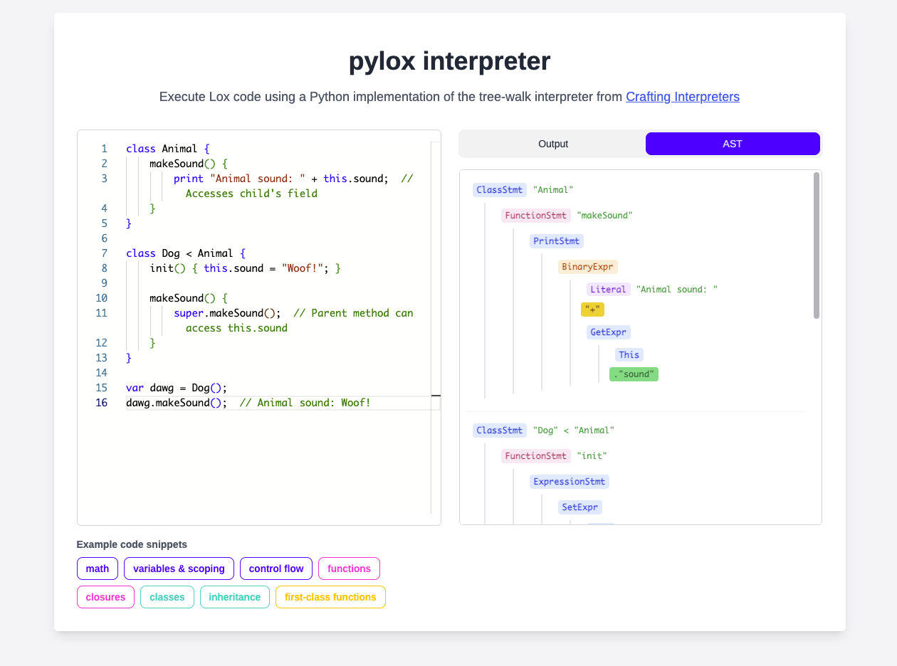

# Crafting Interpreters, in Python

A post about some interesting concepts I learned when building an interpreter, following Robert Nystrom's [Crafting Interpreters](https://craftinginterpreters.com/).

Try out the `pylox` interpreter here: https://pylox.jasonherngwang.com/

Enter code or select a snippet, and view the output and abstract syntax tree (AST). Stack: Django, Turbo, Tailwind.



## Motivation

As a web application engineer who works with high-level languages like Python and Java, I used to view interpreters as a black box. As long as the syntax was correct and the program ran, I didn't dive too deep into what was going on under the hood. However, I received the advice that software engineers should understand at least one level of abstraction below where they usually work, so I've become curious about things like: How does a sequence of symbols like `x = 1 + 2 * 3` get transformed into a math computation? What are the mechanics behind closures and variable scoping? How does `this` work for objects?

To learn more about this, I've been working through the book Crafting Interpreters, which guides us through building a tree-walk interpreter for a C-style language called Lox. It illuminated a lot of concepts, and I highly recommend it. The book uses Java, but I implemented it in Python for fun. A tree-walk interpreter isn't what Python actually uses (it compiles to bytecode), but it's easier to understand and implement.

The main steps are:

```
Source Code → Tokens → Abstract Syntax Tree → Execute code by traversing the tree
```

## 1. From Text to Tokens: Scanning/Lexing

When I look at code, my brain immediately starts grouping characters into words, and converts lines and blocks into familiar structures like conditionals, functions, and classes. However, computers see this same code as just a sequence of individual characters, and need to be able to parse them one-by-by into a form that can then be executed. In order to appreciate how this is done, I had to re-examine the code from the perspective of a computer.

The first step is breaking text into meaningful chunks called **tokens**. In [`scanner.py`](interpreter/scanner.py) we have a giant `if/elif/else` statement which has a branch for each category of character, i.e. whether it's a letter or a brace or an operator. There are various helper functions such as peeking ahead so we can capture 2-character operators like `>=`.

`var x = 42 + 3;` is transformed into the following sequence of tokens:

```python
#   Token(token type, lexeme, literal value, line number)
[
    Token(TokenType.VAR, "var", None, 1),
    Token(TokenType.IDENTIFIER, "x", None, 1),
    Token(TokenType.EQUAL, "=", None, 1),
    Token(TokenType.NUMBER, "42", 42.0, 1),
    Token(TokenType.PLUS, "+", None, 1),
    Token(TokenType.NUMBER, "3", 3.0, 1),
    Token(TokenType.SEMICOLON, ";", None, 1),
]
```

Note: The code is scanned character-by-character, not with regex. Regex can't handle nested structures or languages where indentation matters (like Python).

Relevant files: [`scanner.py`](interpreter/scanner.py), [`token_type.py`](interpreter/token_type.py)

## 2. Building the Tree: Parsing

A flat list of tokens isn't structured enough for code execution. Consider `[1, +, 2, *, 3]` - we can't naively evaluate this left-to-right because that would be incorrect math. Instead, we need to arrange tokens in a way that respects operator precedence (remember PEMDAS from math class?).

One solution is an **Abstract Syntax Tree (AST)**. Tree nodes are called expressions, which could be literal numbers, binary operations such as `+`, and more. Evaluating the following tree ensures `2 * 3` is evaluated before adding it to `1`.

```
   +
 /   \
1     *
     / \
    2   3
```

### Grammar and Precedence

We build these trees using a parser, following the grammar of the language. Grammar rules define what is a valid arrangement of words, i.e. the correct way to organize nodes into a tree. The parser recursively builds the tree by following precedence rules:

```
(lowest precedence)
expression → term ( ( "-" | "+" ) term )*
term       → factor ( ( "/" | "*" ) factor )*
factor     → unary ( "-" unary | primary )*
unary      → ( "!" | "-" ) unary | primary ;
primary    → NUMBER | "(" expression ")"
(highest precedence)
```

Grammar rules are presented in a notation that looks like regex. `expression → term ( ( "-" | "+" ) term )*` can be read as:

- `expression →` means "an expression consists of..."
- `term` means "first parse a term (required)"
- `( ( "-" | "+" ) term )*` means "optionally match 0 or more groups of: (`-` OR `+`, followed by another `term`)"

So `2 + 3 * 4 - 1` gets parsed as: "term + term - term" where the middle term `3 * 4` actually contains nested higher precedence operations.

**Higher precedence operations get parsed first, creating deeper nesting in the tree**. For `2 + 3 * 4 - 1`:

1. Expression: Parse `2` as the first term (becomes a NUMBER), `+` as an operator, and look for another term.
2. Term: Parse `3` as a factor, `*` as an operator, `4` as a factor. We are done and can return a `*` node.
3. Expression: Create a `+` node with `2` and `3 * 4` as operands.
4. Expression: Use the `+` node as the left-hand node. Parse `-` as an operator, and `1` as a term.

```
       -
     /   \
   +      1
 /   \
2      *
     /   \
    3     4
```

These principles apply universally, from expressions to classes to functions. It's pattern matching at different levels.

1. The scanner matches patterns of characters to create a stream of tokens.
2. The parser matches patterns of tokens against grammar, to build the tree.

Full grammar: https://craftinginterpreters.com/appendix-i.html#expressions

Relevant files: [`parser.py`](interpreter/parser.py), [`expressions.py`](interpreter/expressions.py)

## 3. Tree Walking

Now that we have a structured representation of the code, we can execute it by walking through the tree recursively. Post-order traversal (children before parent) ensures operands are fully evaluated before applying operations.

The implementation uses the Visitor Pattern, described in [`expressions`](interpreter/expressions.py).

```python
def visit_binary_expr(self, expr: Expr.Binary) -> Any:
    left = self.evaluate(expr.left)   # Recursively evaluate left
    right = self.evaluate(expr.right) # Recursively evaluate right

    if expr.operator.type == TokenType.PLUS:
        return float(left) + float(right)
    elif # ...other operators
```

> [!TIP]
> Fun fact: Code editors have language servers that continuously parse your code into trees so they can understand structure, notify you of errors, and provide completions!

Relevant file: [`interpreter.py`](interpreter/interpreter.py)

## 4. Variables, Scoping, and the Environment Chain

Variables are stored in an environment (just a hash map). Simple enough, but it gets more interesting with nested scopes.

```lox
var global = "outside";
{
    var local = "inside";
    print global;  // Can access outer scope
}
print local;    // Error: can't access inner scope
```

**Environment chain**: Each scope has a reference to its enclosing scope, creating a chain we can traverse upward:

```python
class Environment:
    def __init__(self, enclosing=None):
        self.values = {}
        self.enclosing = enclosing  # Link to outer scope

    def get(self, name: Token) -> Any:
        if name in self.values:
            return self.values[name]
        if self.enclosing:  # Walk up the chain
            return self.enclosing.get(name)
        raise RuntimeError(f"Undefined variable '{name}'")
```

Relevant files: [`environment.py`](interpreter/environment.py)

## 5. Static Analysis and the Resolver Pass

The environment chain lookup works, but it needs to be performed for every variable access at runtime. This could require a lot of operations for deeply-nested variables. Since Lox is statically scoped, before even executing the code we can perform scope resolution, a type of **semantic analysis**, to identify exactly which variables the names refer to. At the same time, we can pre-compute the environment distance (the number of hops) as a **static analysis** optimization.

```python
class Resolver:
    def resolve_local(self, expr: Expr, name: Token) -> None:
        # Walk backwards through scopes to find variable
        for i in range(len(self.scopes) - 1, -1, -1):
            if name.lexeme in self.scopes[i]:
                # Store the distance for O(1) runtime lookup
                distance = len(self.scopes) - 1 - i
                self.interpreter.resolve(expr, distance)
                return
```

Then, during execution, since we already know (1) the variable exists and (2) where it lives, we can go straight to the target environment without checking each environment's hash.

```python
def get_at(self, distance: int, name: str) -> Any:
    """Use when we know how far up the hierarchy a variable lives"""
    return self.ancestor(distance).values[name]  # No existence check needed!

def ancestor(self, distance: int) -> "Environment":
    environment = self
    for _ in range(distance):
        environment = environment.enclosing
    return environment
```

Static analysis optimizes performance and helps catch errors ahead of time. However, it does require extra passes over the tree, between the parsing and execution stages. Other types of static analysis include:

- Type checking
- Tracking variable declarations vs definitions
- Detecting redeclarations and uninitialized access (see example below)

```lox
var x = x + 1;  // Error: Using 'x' in its own initializer
```

Relevant files: [`environment.py`](interpreter/environment.py), [`resolver.py`](interpreter/resolver.py)

## 6. Functions and Closures

Lox functions are objects that, when created, store the current environment in their `closure` field. This enables them to "remember" variables that were in-scope at the time of creation.

```python
def visit_function_stmt(self, stmt: Stmt.Function) -> None:
    function = LoxFunction(stmt, self.environment)  # Capture current env
    self.environment.define(stmt.name.lexeme, function)
```

In this example `increment` captures a reference to the environment where `count` lives. Even after `makeCounter()` finishes, `increment` can still access and modify `count`.

```lox
fun makeCounter() {
    var count = 0;
    fun increment() {
        count = count + 1;
        return count;
    }
    return increment;
}

var counter = makeCounter();
print counter(); // 1
print counter(); // 2
```

When a function is called, it creates a new environment for local variables, which is **chained to its `closure`**, extending the hierarchy.

```python
class LoxFunction(LoxCallable):
    def __init__(self, declaration: Stmt.Function, closure: Environment):
        self.declaration = declaration
        self.closure = closure  # Remember creation environment

    def call(self, interpreter: "Interpreter", arguments: List[Any]) -> Any:
        environment = Environment(self.closure)  # New env with closure as parent

        # Bind parameters
        for i, param in enumerate(self.declaration.params):
            environment.define(param.lexeme, arguments[i])

        # Execute in new environment
        interpreter.execute_block(self.declaration.body, environment)
```

Relevant files: [`interpreter.py`](interpreter/interpreter.py), [`environment.py`](interpreter/environment.py)

## 7. Classes, Methods, and `this`

In Lox, classes are callable objects that act as factories for creating instances. Methods are just regular functions stored as properties on class objects.

```lox
class Counter {
    increment() {
        this.count = this.count + 1;
        return this.count;
    }
}

var counter = Counter();  // Classes are callable
```

### Method Calls

When you call `counter.increment()`, the interpreter does 2 things:

1. Search for `increment` in two places:
   - Check if it exists as a field on the counter instance.
   - If not found, check if it exists as a method on the Counter class.
2. Function call: Call that function with the counter instance as the implicit `this` parameter.

### The `this` Problem

Every time you access a method, whether directly or extracting it, it needs to remember which object it belongs to:

```lox
var counter = Counter();
counter.increment();  // Direct call
var method = counter.increment;  // Extract method
print method();  // Should still work!
```

In both scenarios, method invocation actually creates a new function with `this` already set to the correct object. This is necessary so the method can access data from the instance's fields.

```python
def bind(self, instance: "LoxInstance") -> "LoxFunction":
    environment = Environment(self.closure)
    environment.define("this", instance)  # Set 'this' to the instance
    return LoxFunction(self.declaration, environment, self.is_initializer)
```

Relevant file: [`interpreter.py`](interpreter/interpreter.py)

## 8. Inheritance as Delegation

Inheritance is a way of delegating. When a method isn't found on a class, the interpreter delegates the lookup to the parent class.

When you call `dog.makeSound()`, the interpreter follows a chain of lookups:

```lox
class Animal {
    makeSound() {
        print "Animal sound: " + this.sound;
    }
}

class Dog < Animal {
    // No makeSound method here
}

var dog = Dog();
dog.sound = "Woof!";
dog.makeSound();  // Found in Animal class
```

The lookup chain is: `Dog` → `Animal` → `nil`. This is implemented as a recursive function:

```python
def find_method(self, name: str) -> Optional[LoxFunction]:
    if name in self.methods:
        return self.methods[name]  # Found in current class

    if self.superclass is not None:
        return self.superclass.find_method(name)  # Delegate to parent

    return None  # Not found anywhere
```

### `super` and the Environment Chain

The `super` keyword is a way to access the parent class's methods while maintaining the current object's context:

```lox
class Dog < Animal {
    makeSound() {
        super.makeSound();  // Call parent's method on current object
    }
}
```

This works by creating nested environments during class definition. The outer environment holds the superclass reference, and the inner environment holds the current instance. When defining a class with inheritance:

```python
if stmt.superclass is not None:
    self.environment = Environment(self.environment)  # Outer env for 'super'
    self.environment.define("super", superclass)

# ... define methods in inner environment with access to 'this' ...
```

When you use `super.method()`, the interpreter:

1. Looks up `super` in the outer environment (gets the parent class)
2. Looks up `this` in the inner environment (gets the current instance)
3. Finds the method on the parent class
4. Binds it to the current instance

This ensures parent methods run in the context of the child object.

Relevant file: [`interpreter.py`](interpreter/interpreter.py)

## All the steps together

```python
def run(self, source):
    scanner = Scanner(source)
    tokens = scanner.scan_tokens()

    parser = Parser(tokens)
    statements = parser.parse()

    resolver = Resolver(self.interpreter)
    resolver.resolve_statements(statements)

    self.interpreter.interpret(statements)
```

Relevant file: [`pylox.py`](interpreter/pylox.py)
